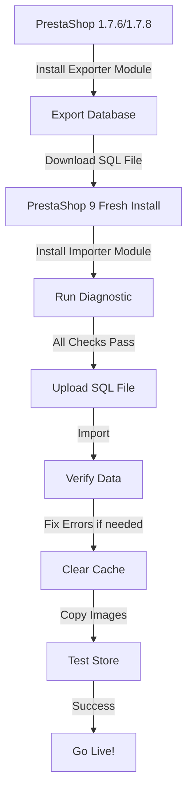

# PrestaShop 9 Database Importer for 1.7.x Migrations


## 📋 Description

**PrestaShop 9 Database Importer** is the companion module for importing database exports from PrestaShop 1.7.6/1.7.8 into PrestaShop 9.

This module works together with the [Migration Exporter Module](https://github.com/droidhispalis/Migration-Prestashop-1.7-to-9) to provide a complete migration solution.

### ✨ Key Features

- 📥 **Direct SQL Import** - Import SQL files generated by the exporter module
- 🔍 **Pre-Import Diagnostics** - Verify database compatibility before importing
- 🛡️ **Safe Import Process** - Uses transactions to protect your data
- 📊 **Real-time Progress** - Visual feedback during import
- ⚠️ **Error Handling** - Detailed error reporting and recovery options
- 🔧 **Post-Import Verification** - Automatic data integrity checks

---

## 🎯 Complete Migration Solution

This module is **part 2** of the complete migration process:

| Step | Module | PrestaShop Version | Action |
|------|--------|-------------------|---------|
| **1** | [Migration Exporter](https://github.com/droidhispalis/Migration-Prestashop-1.7-to-9) | 1.7.6 / 1.7.8 | Export database |
| **2** | **Migration Importer** (this module) | 9.0+ | Import database |

---

## 📦 Installation

### Requirements

- ✅ PrestaShop **9.0** or higher
- ✅ PHP **8.1** or higher
- ✅ MySQL/MariaDB database access
- ✅ Sufficient disk space for SQL file upload
- ✅ `max_execution_time` = 3600 or higher (recommended)
- ✅ `memory_limit` = 512M or higher (recommended)

### Installation Steps

1. **Download the module:**
   ```bash
   git clone https://github.com/droidhispalis/Migration-Prestashop-9-fro-1.7.6.git
   cd Migration-Prestashop-9-fro-1.7.6
   zip -r psimporter9from178.zip .
   ```

2. **Upload to PrestaShop 9:**
   - Go to **Modules** → **Module Manager**
   - Click **Upload a module**
   - Select `psimporter9from178.zip`
   - Click **Install**

3. **Configure the module:**
   - Go to **Modules** → **Module Manager**
   - Search for "PrestaShop 9 Importer"
   - Click **Configure**

---

## 🚀 Usage

### Step 1: Prepare the SQL File

First, you need to export your database from PrestaShop 1.7.x using the [Migration Exporter Module](https://github.com/droidhispalis/Migration-Prestashop-1.7-to-9).

This will generate a file like:
```
prestashop_export_2025_12_05.sql
```

### Step 2: Run Diagnostic (Recommended)

Before importing, run the diagnostic tool to verify compatibility:

1. Access the diagnostic page:
   ```
   https://your-ps9-store.com/modules/psimporter9from178/diagnostic.php
   ```

2. Review the diagnostic results:
   - ✅ PHP version
   - ✅ Database connection
   - ✅ File permissions
   - ✅ Server configuration
   - ✅ Required extensions

3. Fix any issues before proceeding

### Step 3: Import Database

1. **Go to the module configuration page**
   - Modules → Module Manager → PrestaShop 9 Importer → Configure

2. **Upload SQL File**
   - Click **Choose File**
   - Select your SQL export file
   - Maximum file size: Check your `upload_max_filesize` setting

3. **Start Import**
   - Click **Import Database**
   - ⚠️ **DO NOT CLOSE** the browser window
   - Wait for the process to complete
   - This may take 5-30 minutes depending on database size

4. **Review Results**
   - Check the import log for any errors
   - Verify imported data counts
   - Note any warnings or issues

### Step 4: Clear Cache

After successful import:

```bash
# Via SSH (recommended)
cd /path/to/your/prestashop
rm -rf var/cache/*

# Or via FTP
# Delete contents of: /var/cache/prod/ and /var/cache/dev/
```

### Step 5: Post-Import Verification

1. **Test the Back Office:**
   - Products → Check product listings
   - Orders → Verify order history
   - Customers → Check customer accounts
   - Categories → Verify category tree

2. **Test the Front Office:**
   - Browse categories
   - View product pages
   - Test search functionality
   - Check shopping cart

---

## 🔧 Troubleshooting

### Common Issues

#### ❌ Error 500 after import

**Cause:** NULL values in database fields that require strings/integers in PS 9

**Solution:** Run the SQL fix script:

1. Access phpMyAdmin
2. Select your PrestaShop 9 database
3. Execute this SQL:

```sql
-- Fix NULL values in ps_product_lang
UPDATE ps_product_lang 
SET description = COALESCE(description, ''),
    description_short = COALESCE(description_short, ''),
    link_rewrite = COALESCE(link_rewrite, 'product'),
    meta_title = COALESCE(meta_title, ''),
    meta_description = COALESCE(meta_description, '');

-- Fix NULL values in ps_product
UPDATE ps_product 
SET ean13 = COALESCE(ean13, ''),
    isbn = COALESCE(isbn, ''),
    upc = COALESCE(upc, ''),
    mpn = COALESCE(mpn, ''),
    reference = COALESCE(reference, '');

-- Clear cache
TRUNCATE TABLE ps_smarty_cache;
```

📄 **Complete fix available:** Check the [SQL_FIXES folder](https://github.com/droidhispalis/Migration-Prestashop-1.7-to-9/tree/main/SQL_FIXES) in the exporter module.

---

#### ⏱️ Import timeout

**Cause:** Large database or low server limits

**Solution 1 - Increase PHP limits:**

Edit `php.ini`:
```ini
max_execution_time = 3600
max_input_time = 3600
memory_limit = 512M
upload_max_filesize = 512M
post_max_size = 512M
```

**Solution 2 - Import via command line:**

```bash
# SSH to your server
cd /path/to/prestashop
mysql -u username -p database_name < export_file.sql
```

---

#### 📦 Upload size limit

**Cause:** SQL file larger than `upload_max_filesize`

**Solutions:**

1. **Split the SQL file:**
   ```bash
   split -l 10000 export.sql export_part_
   ```

2. **Import via phpMyAdmin:**
   - Use phpMyAdmin's import feature
   - It handles large files better

3. **Import via SSH/terminal:**
   ```bash
   mysql -u user -p database < export.sql
   ```

---

#### 🔑 Duplicate key errors

**Cause:** Data already exists in database

**Solution:**

The exporter module already uses `INSERT IGNORE` for critical tables. If you still get errors:

1. **Fresh installation recommended** - Start with a clean PS 9 database
2. **Manual fix** - Remove conflicting records first
3. **Contact support** - Share the error log

---

#### 🖼️ Missing images

**Cause:** Images are not included in SQL export

**Solution:**

Images must be copied separately via FTP/SSH:

```bash
# From PrestaShop 1.7.x server
cd /path/to/ps1.7/
tar -czf images.tar.gz img/

# Transfer to PrestaShop 9 server
scp images.tar.gz user@ps9server:/path/to/ps9/

# Extract on PrestaShop 9
cd /path/to/ps9/
tar -xzf images.tar.gz
chown -R www-data:www-data img/
chmod -R 755 img/
```

Or use the included `img` folder structure from your export.

---

#### 👁️ Imported products not visible in Front Office

**Cause:** Missing `ps_product_shop` records or incorrect visibility settings

**Symptoms:**
- Products appear correctly in Back Office
- Products **don't show** in Front Office (categories, search, product page)
- New products created in PS 9 work fine
- Only imported products have this issue

**Solution:**

This is the **#1 most common issue** after migration. We've created a complete fix:

1. **Run diagnostic:**
   - Download `DIAGNOSTIC_PRODUCT_VISIBILITY.sql` from the exporter repo
   - Execute in phpMyAdmin
   - Review which problems affect your products

2. **Apply automatic fix:**
   - Download `FIX_PRODUCT_VISIBILITY.sql`
   - **Make a backup first!**
   - Execute in phpMyAdmin
   - Script fixes 8 common issues automatically

3. **Clear cache (REQUIRED):**
   ```bash
   cd /path/to/prestashop
   rm -rf var/cache/*
   ```

4. **Regenerate search index:**
   - Back Office → Preferences → Search
   - Click "Regenerate entire index"

5. **Verify:**
   - Check products in Front Office
   - Test categories and search

📖 **Complete guide:** See [README_PRODUCT_VISIBILITY.md](https://github.com/droidhispalis/Migration-Prestashop-1.7-to-9/blob/main/README_PRODUCT_VISIBILITY.md) in the exporter repository.

**What the fix does:**
- ✅ Creates missing `ps_product_shop` records
- ✅ Sets visibility to 'both'
- ✅ Assigns products to categories
- ✅ Generates missing link_rewrite URLs
- ✅ Configures stock properly
- ✅ Marks products for reindexing

---

## 📊 What Gets Imported?

### Core Data ✅

- ✅ Products (all attributes, combinations, features)
- ✅ Categories (tree structure preserved)
- ✅ Customers (accounts, addresses, groups)
- ✅ Orders (full order history, details, payments)
- ✅ Cart rules (discounts, vouchers)
- ✅ CMS pages (content pages)
- ✅ Carriers (shipping methods)
- ✅ Languages (if installed in PS 9)
- ✅ Currencies (if enabled in PS 9)
- ✅ Manufacturers & Suppliers
- ✅ Attributes & Features
- ✅ Tags
- ✅ Contacts
- ✅ Stores

### What's NOT Imported ❌

- ❌ Images (must be copied manually)
- ❌ Modules (must be reinstalled)
- ❌ Theme files (not compatible)
- ❌ Configuration settings (PS 9 config preserved)
- ❌ Employee accounts (security)
- ❌ Logs

---

## ⚙️ Advanced Configuration

### Server Configuration

**Apache (.htaccess):**
```apache
php_value max_execution_time 3600
php_value max_input_time 3600
php_value memory_limit 512M
php_value upload_max_filesize 512M
php_value post_max_size 512M
```

**Nginx (php-fpm pool config):**
```ini
php_admin_value[max_execution_time] = 3600
php_admin_value[max_input_time] = 3600
php_admin_value[memory_limit] = 512M
php_admin_value[upload_max_filesize] = 512M
php_admin_value[post_max_size] = 512M
```

### Database Configuration

**MySQL/MariaDB optimizations:**
```sql
SET GLOBAL max_allowed_packet=1073741824;
SET GLOBAL wait_timeout=600;
SET GLOBAL interactive_timeout=600;
```

---

## 🔍 Diagnostic Tool

The module includes a built-in diagnostic tool accessible at:

```
https://your-store.com/modules/psimporter9from178/diagnostic.php
```

### Checks Performed:

- ✅ PHP version compatibility
- ✅ Database connection
- ✅ Required PHP extensions
- ✅ File permissions
- ✅ Memory limits
- ✅ Execution time limits
- ✅ Upload limits
- ✅ Database privileges
- ✅ Disk space

---

## 📝 Import Log Example

```
[2025-12-05 10:30:15] Starting import process...
[2025-12-05 10:30:16] File size: 45.3 MB
[2025-12-05 10:30:16] Checking database connection... OK
[2025-12-05 10:30:17] Starting transaction...
[2025-12-05 10:30:18] Importing categories... 150 records
[2025-12-05 10:31:45] Importing products... 3,456 records
[2025-12-05 10:35:20] Importing customers... 12,890 records
[2025-12-05 10:38:05] Importing orders... 8,234 records
[2025-12-05 10:42:30] Committing transaction...
[2025-12-05 10:42:35] Import completed successfully!
[2025-12-05 10:42:35] Total time: 12 minutes 20 seconds
```

---

## 🆘 Support

### Issues & Questions

- 🐛 **Bug Reports:** [Open an issue](https://github.com/droidhispalis/Migration-Prestashop-9-fro-1.7.6/issues)
- 💡 **Feature Requests:** [Open an issue](https://github.com/droidhispalis/Migration-Prestashop-9-fro-1.7.6/issues)
- 📖 **Documentation:** Check the [Wiki](https://github.com/droidhispalis/Migration-Prestashop-9-fro-1.7.6/wiki)

### Related Resources

- 📤 [Migration Exporter Module](https://github.com/droidhispalis/Migration-Prestashop-1.7-to-9)
- 🔧 [SQL Fix Scripts](https://github.com/droidhispalis/Migration-Prestashop-1.7-to-9/tree/main/SQL_FIXES)
- 📚 [PrestaShop 9 Documentation](https://devdocs.prestashop-project.org/9/)

---

## 🤝 Contributing

Contributions are welcome! Please:

1. Fork the repository
2. Create a feature branch: `git checkout -b feature/amazing-feature`
3. Commit your changes: `git commit -m 'Add amazing feature'`
4. Push to the branch: `git push origin feature/amazing-feature`
5. Open a Pull Request

---

## 📄 License

This module is licensed under the **Academic Free License (AFL 3.0)** - same as PrestaShop.

---

## ⚠️ Disclaimer

**ALWAYS** test the migration on a staging/development environment before production!

- ✅ Make a full backup of your PrestaShop 9 database before importing
- ✅ Test thoroughly after import
- ✅ Keep backups of both source and destination databases
- ⚠️ The authors are not responsible for data loss

---

## 🎯 Migration Workflow Summary



---

## 📊 Version History

### v1.0.0 (2025-12-05)
- ✨ Initial release
- 📥 SQL import functionality
- 🔍 Diagnostic tool
- 📊 Progress tracking
- ⚠️ Error handling

---

## 🙏 Acknowledgments

- PrestaShop community for documentation and support
- All contributors and testers
- Users who provided feedback

---

**Made with ❤️ for the PrestaShop community**

**Need help with your migration?** Open an issue or check existing discussions!
